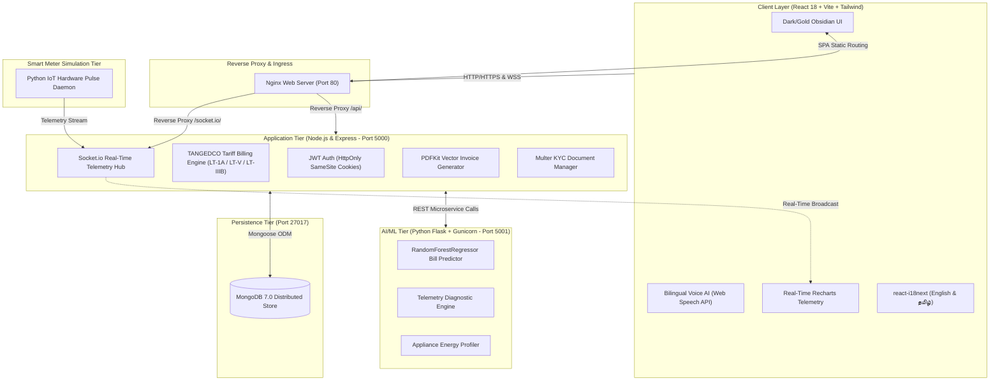

# Smart Tamil Nadu Electricity Platform ⚡
### Enterprise Smart Metering, AI Energy Intelligence & TANGEDCO Tariff Optimization Platform


---

## 🏛️ Executive Summary
The **Smart Tamil Nadu Electricity Platform** is an enterprise-grade energy intelligence and smart billing solution built for consumers and administrators under the **Tamil Nadu Generation and Distribution Corporation (TANGEDCO)** and the **Tamil Nadu Electricity Regulatory Commission (TNERC)**.

Designed around a modern dark-obsidian and gold design system, the platform solves critical energy management hurdles in Tamil Nadu:
1. **Subsidy Cliff Prevention**: Visualizes and protects the Government of Tamil Nadu's 200 free units subsidy through the **Subsidy Risk Meter**.
2. **Multi-Tariff Scaling**: Implements exact billing rules for **Domestic (LT-1A Telescopic)**, **Commercial (LT-V Non-Telescopic)**, and **Industrial (LT-IIIB Flat + Fixed Demand)**.
3. **Sub-Second IoT Telemetry**: Streams bidirectional smart meter telemetry (active power, voltage, current, power factor, grid frequency) over WebSockets.
4. **Actionable Equipment Diagnostics**: Uses Scikit-Learn machine learning to translate consumption anomalies into plain-language diagnoses (e.g., overnight AC compressor leaks, pump capacitor wear).
5. **Renewable Transition (PM Surya Ghar)**: Calculates rooftop solar sizing, capital subsidies (₹30,000 to ₹78,000 DBT), net costs, and ROI under the national solar mission.
6. **Bilingual Accessibility**: Full English and தமிழ் (Tamil) localization with interactive Web Speech AI voice recognition.

---

## 🏗️ System Architecture



---

## ⚡ Core Feature Showcase

### 1. 🛡️ TANGEDCO Subsidy Risk Meter
- **Replaces Confusing Jargon**: Eliminates technical phrases like *"Subsidy Cliff"*.
- **3-Zone Visual Gauge**:
  - 🟢 **Safe Zone (0 - 400 kWh)**: Consumer enjoys 200 free units and lowest subsidized rates (₹4.50/unit).
  - 🟡 **Warning Zone (400 - 500 kWh)**: Highlights imminent subsidy loss danger.
  - 🔴 **Penalty Zone (> 500 kWh)**: Warns that 200 free units have been revoked and all units are billed up to ₹11.00/unit.
- **Dynamic Plain-Language Warning Engine**:
  > *"If you use 15 more units, you will lose your government subsidy and your rate will double."*  
  > *"நீங்கள் இன்னும் 15 யூனிட்களைப் பயன்படுத்தினால், உங்கள் அரசு மானியத்தை இழப்பீர்கள், உங்கள் மின்கட்டணம் இருமடங்காக உயரும்."*
- **Interactive Simulator**: Real-time slider (50–750 kWh) to model bi-monthly bills and threshold transitions instantly.

### 2. 📊 Universal Tariff Engine (Domestic, Commercial, Industrial)
- **LT-1A Domestic (Telescopic)**:
  - Consuming ≤ 500 units: 0–200 free, 201–400 @ ₹4.50, 401–500 @ ₹6.00.
  - Consuming > 500 units: 0–100 base, 101–400 @ ₹4.50, 401–500 @ ₹6.00, 501–600 @ ₹8.00, 601–800 @ ₹9.00, 801–1000 @ ₹10.00, >1000 @ ₹11.00.
- **LT-V Commercial (Non-Telescopic Punitive)**:
  - Consuming ≤ 100 units: All units billed at ₹6.65.
  - Consuming > 100 units: Flat **₹10.45/unit across ALL units from unit 1** + ₹110/kW demand charges + 5% Electricity Tax.
- **LT-IIIB Industrial (Manufacturing & MSME)**:
  - Flat energy charge of **₹7.65/unit**.
  - Bi-monthly fixed demand charges of **₹600.00/kW**.
  - 5% State Electricity Duty levied on total subtotal.

### 3. 🔍 Actionable Equipment Anomaly Detection
- Replaces raw statistical variance with equipment diagnoses:
  - **Overnight Surge (2:00 AM - 4:00 AM)**: Flags non-stop AC compressor or faulty refrigerator door gasket.
  - **Heavy Appliance Overlap**: Advises against simultaneous morning operation of water heater and AC to prevent breaker trips.
  - **Inductive Motor Loss**: Detects low power factor (PF < 0.88) on water pumps, recommending capacitor replacement to save ~12% on inductive draw.

### 4. ☀️ PM Surya Ghar: Muft Bijli Yojana (Rooftop Solar)
- Calibrated to Tamil Nadu solar irradiance (~120 units/month per kW).
- Computes:
  - Recommended capacity (kW)
  - Gross project cost (~₹60,000/kW benchmark)
  - **Direct Central Government DBT Subsidy**: ₹30,000 for 1 kW, ₹60,000 for 2 kW, capped at ₹78,000 for 3–10 kW.
  - Net out-of-pocket investment & accelerated payback period (~2-3 years).
  - Lifetime CO₂ offset and 1-click link to the official National Portal.

### 5. 📡 Sub-Second IoT Telemetry & Grid Monitoring
- Bidirectional WebSocket pipeline streaming 6 electrical metrics: Active Power (kW), Voltage (V), Current (A), Cumulative Energy (kWh), Power Factor, and Grid Frequency (Hz).
- Under-voltage grid alerts (< 215V) and overload protection warnings.

### 6. 🎙️ Bilingual Voice AI Assistant (English & தமிழ்)
- Speech recognition and speech synthesis powered by the Web Speech API.
- NLP query routing for bill inquiries, subsidy risk status, live meter navigation, and energy-saving tips in English and தமிழ்.

### 7. 📄 Official TANGEDCO Tax Invoices (PDFKit)
- Vector-rendered PDF tax invoices with official TANGEDCO header, consumer details, QR code authenticity stamp, and itemized slab breakdowns streamed directly to the client.

### 8. 🛡️ Admin Portal & KYC Verification
- Multi-document inspection lightbox (Aadhar, Property Tax, Trade License).
- 1-click KYC Approve/Reject workflow with administrative audit trail.
- 3-way cyclic tariff category switcher (`Domestic ⇄ Commercial ⇄ Industrial`).

---

## 🔌 API Endpoints Reference

| Method | Endpoint | Access | Description |
| :--- | :--- | :--- | :--- |
| `POST` | `/api/auth/register` | Public | Register new consumer profile |
| `POST` | `/api/auth/login` | Public | Authenticate & issue HttpOnly JWT cookie |
| `POST` | `/api/auth/google` | Public | Google OAuth 2.0 Single Sign-On |
| `GET` | `/api/auth/me` | Private | Hydrate authenticated session from cookie |
| `POST` | `/api/auth/logout` | Private | Clear authentication cookie |
| `GET` | `/api/bills/tariffs` | Public | Fetch official TANGEDCO tariff schedule |
| `POST` | `/api/bills/calculate` | Private | Simulate bill (Domestic, Commercial, Industrial) |
| `POST` | `/api/bills` | Private | Generate and commit official bi-monthly bill |
| `GET` | `/api/bills/history` | Private | Retrieve archived invoices for consumer |
| `GET` | `/api/reports/invoice` | Private | Stream vector PDF tax invoice |
| `GET` | `/api/iot/telemetry/:serviceNo` | Private | Fetch historical smart meter telemetry |
| `POST` | `/api/predictions/next-month` | Private | ML Random Forest monthly bill prediction |
| `POST` | `/api/predictions/appliance-advice`| Private | AI energy advisor & load profiling |
| `GET` | `/api/insights/anomalies` | Private | Actionable equipment diagnostics & anomalies |
| `GET` | `/api/insights/recommendations` | Private | Energy conservation recommendations |
| `POST` | `/api/renewables/solar` | Private | PM Surya Ghar solar sizing & subsidy calculator |
| `POST` | `/api/renewables/battery` | Private | Inverter battery ampere-hour (Ah) sizer |
| `POST` | `/api/renewables/ev` | Private | EV charging running cost calculator |
| `GET` | `/api/admin/stats` | Admin | Administrative platform KPI metrics |
| `GET` | `/api/admin/consumers` | Admin | Consumer directory & KYC status ledger |
| `PUT` | `/api/admin/verify/:id` | Admin | Approve or reject consumer KYC accreditation |
| `PUT` | `/api/admin/connection-type/:id` | Admin | Switch tariff (`LT-1A` / `LT-V` / `LT-IIIB`) |
| `GET` | `/api/health` | Public | Healthcheck endpoint |

---

## 🔑 Default Demo Credentials

| Role | Email Address | Password | Permissions |
| :--- | :--- | :--- | :--- |
| **Consumer** | `consumer@smarttn.gov` | `consumer123` | Dashboard, Live IoT, Bill Calculator, Risk Meter, Renewables, PDF Invoices |
| **Admin** | `admin@smarttn.gov` | `adminpassword123` | KYC Document Review, Tariff Switching, System Health, Consumer Management |

---

## 🐳 Docker Deployment (Production)

The platform is containerized using multi-stage Alpine/Slim images and orchestrated via Docker Compose.

```bash
# 1. Clone the repository
git clone https://github.com/your-org/tamilnadu-smart-electricity.git
cd tamilnadu-smart-electricity

# 2. Build and launch all 4 containers in the background
docker-compose up -d --build

# 3. Verify running containers
docker-compose ps
```

### Access Endpoints:
- **Frontend Application:** [http://localhost](http://localhost) (Port 80)
- **Node.js REST & WebSockets:** [http://localhost:5000](http://localhost:5000)
- **Python Flask AI/ML:** [http://localhost:5001](http://localhost:5001)
- **MongoDB:** `mongodb://localhost:27017`

---

## 💻 Native Development Setup (Windows / macOS / Linux)

### Prerequisites
- Node.js >= 18.x
- Python >= 3.10
- MongoDB Community Server running on `localhost:27017`

### Step 1: Start MongoDB
Ensure MongoDB is running locally:
```powershell
mongod --dbpath C:\data\db
```

### Step 2: Start Python AI/ML Microservice
```powershell
cd ai-ml
python -m venv venv
.\venv\Scripts\activate
pip install -r requirements.txt
python ml_service.py
# Running on http://127.0.0.1:5001
```

### Step 3: Start Node.js Backend API
```powershell
cd backend
npm install
node src/utils/seeder.js  # Seeds demo consumer, admin, tariffs, and initial telemetry
npm run dev
# Running on http://localhost:5000
```

### Step 4: Start React Frontend
```powershell
cd frontend
npm install
npm run dev
# Running on http://localhost:5173
```

---

## 👥 Engineering Team
1. **Rathi Chandhrika**: Consumer Billing & Tariff Architecture (Auth, TANGEDCO Multi-Tariff Engine, Industrial Scaling, Calculator UI).
2. **Vishali**: IoT & Telemetry Engineering (Python Hardware Simulator, Socket.io Telemetry Pipeline, Real-Time Recharts Gauges).
3. **Preethi**: AI/ML Analytics & Renewable Energy (Scikit-Learn Random Forest Regression, PM Surya Ghar Solar Subsidy Engine).
4. **Pavana**: Security, DevOps & System Administration (RBAC, HttpOnly Cookie Hardening, Vector PDF Reports, Docker Orchestration).

---

## 📜 License & Compliance
Governed under the open government technology framework in accordance with the **Tamil Nadu Electricity Regulatory Commission (TNERC)** Tariff Order and Government of Tamil Nadu Energy Department regulations (GO Ms. No. 25).